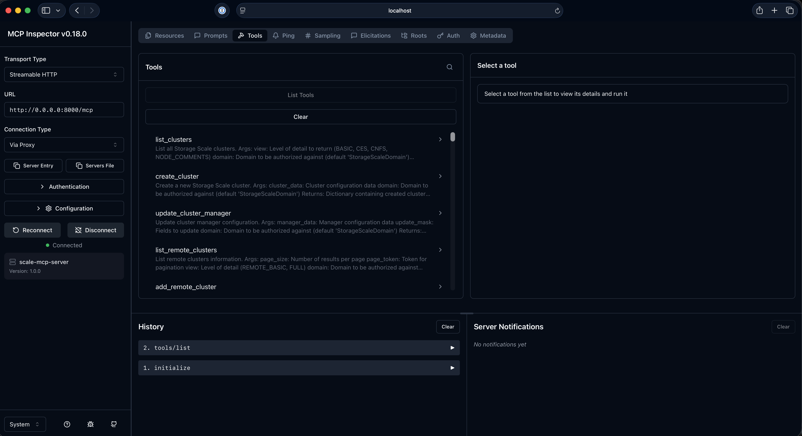

# IBM Storage Scale MCP Server

Model Context Protocol (MCP) server for interacting with IBM Storage Scale.

>[NOTE]
>This MCP server supports both StreamableHTTP and stdio transports. By default, it uses StreamableHTTP transport on `127.0.0.1:8000`.

## Installation Guide

### Prerequisites

- Python 3.12 or later
- UV package manager (`curl -LsSf https://astral.sh/uv/install.sh | sh`)

### Installation

1. **Clone the repository**:
   ```bash
   git clone https://github.com/IBM/ibm-storage-scale-mcp-server.git
   cd ibm-storage-scale-mcp-server
   ```

2. **Install dependencies using uv**:
   ```bash
   uv venv
   source .venv/bin/activate
   uv pip install .
   ```

2. **Configure Scale connection settings**:
   
   Edit [`config/scale_config.ini`](config/scale_config.ini) with your IBM Storage Scale cluster details:
   
   ```ini
   [scale_api]
   hostname = your-scale-cluster.example.com
   v2_port = 443
   v3_port = 46443
   timeout = 5.0
   
   [authorization]
   username = your-username
   password = your-password
   allow_insecure = true
   
   [domain]
   domain = your-domain
   ```
   
   Replace the placeholder values with your actual Scale cluster credentials and connection details.

3. **Start the server using uv or python**:
   ```bash
   # Using uv (default: HTTP transport on localhost:8000)
   uv run scale-mcp-server
   ```

### Usage Examples

```bash
# Run with HTTP transport on default port (localhost:8000)
scale-mcp-server --transport http

# Run with HTTP transport binding to all interfaces
scale-mcp-server --transport http --host 0.0.0.0

# Run with HTTP transport on custom port
scale-mcp-server --transport http --port 3000

# Run with stdio transport
scale-mcp-server --transport stdio

# Run with custom host, port, and log level
scale-mcp-server --transport http --host 0.0.0.0 --port 3000 --log-level DEBUG
```

## Usage and Integration

### Using MCP Inspector

The MCP server can be tested directly using [MCP Inspector](https://github.com/modelcontextprotocol/inspector).

#### Prerequisites

Follow the [setup instructions](https://github.com/modelcontextprotocol/inspector?tab=readme-ov-file#quick-start-ui-mode) from MCP Inspector.

#### Connecting via HTTP Transport

1. **Start the MCP server**:
   ```bash
   scale-mcp-server --transport http
   ```

2. **Connect MCP Inspector**:
   ```bash
   mcp-inspector http://localhost:8000
   ```

   

3. **Test the server**:
   - MCP Inspector will open in your browser
   - You can browse available tools
   - Test tool calls and verify responses

## Reporting Issues and Feedback

For issues, questions, or feature requests, please open an issue in the repository.

## Contributing Code

Contributions are welcome via Pull Requests. Please submit your very first Pull Request against the Developer's Certificate of Origin (DCO) located at [DCO.md](DCO.md) using your name and email address.

1. **Fork the repository** and create a new branch for your feature or bug fix
2. **Make your changes** following the existing code style and conventions
3. **Test your changes** thoroughly to ensure they work as expected
4. **Submit a pull request** with a clear description of your changes
5. **Sign the DCO** by adding your name and email address to the DCO.md file in your pull request

## Disclaimer

This software is provided "as is" without any warranties of any kind, including, but not limited to their installation, use, or performance. We are not responsible for any damage or charges or data loss incurred with their use. You are responsible for reviewing and testing any scripts you run thoroughly before use in any production environment. This content is subject to change without notice.
